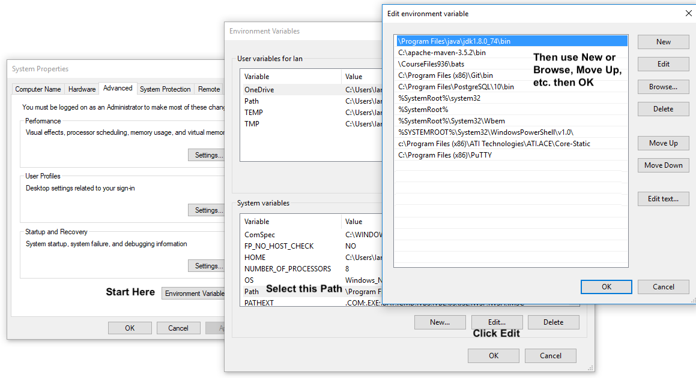

= CourseFiles936

This directory _CourseFiles936_ contains the web pages and exercise projects for
http://learningtree.com[Learning Tree]'s
http://learningtree.com/936[Course 936, Enterprise Java Applications: JSF, EJB3, JSF and AJAX].

The _sourcecode_ subdirectory of the current folder is intended to be the root of an Eclipse Workspace

This is for the J.2 Revision (2018); *do not* try to use this earlier versions as the directory structure has changed.

All code is copyright (C) by Learning Tree International.

This code won't do you much good unless you're taking the course.

There is one other adjacent folder, TicketManorJava, which is hosted on 
LearningTree's GitHub account, https://github.com/LearningTree/TicketmanorJava/.

There are several adjacent folders hosted on the author's github,
https://github.com/IanDarwin/, including jsfdemo jpademo clublist javasrc.
There is also the _makehandsons_ project which makes the hands-on exercises from 
the solutions, so they are always in synch.

== Set Up the Environment at Home or Work

To set up the environment at home or work, you should try the following
(the implementing command examples are for Unix, Linux, Mac OS X,
and might work on MS-Windows with CygWin or equivalent):

* Make sure you have 
Java SE (8 or 9), 
Maven 3 (https://maven.apache.org), 
a database (https://postgresql.org/)
and _git_ (https://git-scm.com/)
installed and on your PATH.
* Start the postgres database if needed (the installer normally starts it for you).
* Make sure you have Wildfly installed but not running;
you could use a different App Server but you'd have to change
all the Maven deployment configurations (most projects have 
GlassFish and Tomcat in _pom.xml_, but this is unmaintained!!)
AND the DataSource configurations (alas, the EE spec doesn't nail down how to do this).
* MS-Windows users must also install Cygwin 64 bit (includes shells and vi), including:
** cygwin base;
** git (at least the basic package, under devel);
** unzip
** ssh or anything else you want.

From here you can either use `git clone` to download individual pieces and have the option to update
later using git, or, just download the Zip file from Learning Tree and unzip it.
For using git:

* Git clone the following projects into a single parent directory
(in the course we use C:\ but anyplace *should* work):
----
cd WHERE_YOU_INSTALL
for repo in LearningTree/TicketManorJava \
	IanDarwin/{CourseFiles936,clublist,javasrc,darwinsys-api,jsfdemo,jpademo,cdi-ee-examples,makehandsons,createprojects}
do
    git clone https://github.com/$repo
done
----

Now you have to set up the database:

* Create a 'student' account inside Postgres, giving the PostGres Admin password when prompted;
----
	psql <<!
	create role student password 'student' login;
	!
----
* Install the psql password file for this account.  For Windows:
----
	mkdir %APPADATA%\postgresql			# Windows step 1
	copy configs\pgpass.conf %APPDATA%\postgresql # Windows step 2
----
For Mac or Unix/Linux:
----
	cp configs/pgpass.conf ~/.pgpass	# *Nix, Mac step 1
	chmod 0600 ~/.pgpass				# *Nix, Mac step 2
----
* Create databases:
----
	psql <<!
	create user student password 'student' login nosuperuser;
	create database ticketmanor owner student;
	create database jpademo owner student;
	create database jpa_basic owner student;
	create database jpa_inheritance owner student;
	create database jpa_aggregation owner student;
	!
----
* Decide if you want JMS or not.
If so, use config file standalone-full.xml in the following; if not, use standalone.xml
and delete sourcecode/ex53solution.
If so, see the README in ex53 for one additional step.
* Merge configs/datasources into wildfly config file standalone/configuration/CHOSEN_CONFIG_FILE
* Download Jenkins (latest LTS jenkins.war) from jenkins.org; copy it to WILDFLY_HOME/standalone/deployments
* You can save a bit of time by pre-creating the _testuser_ account in Wildfly, by pasting
this line into the file application-users.properties file in the standalone/configuration directory
	testuser=539580a56fb54850e92d0d2221b47359
and this line into application-roles.properties.
	testuser=guest,testuser
Alternately you can create these manually the way we do in the exercise in the Security chapter.
but the testuser account is needed by e.g., the JMS exercise.
Obviously this username and password combination must not be used on any internet-accessible server!
* Start Wildfly: cd WILDFLY_HOME; bin/standalone -c standalone-full.xml
(if you don't want JMS support omit the -c and the filename).
* If it doesn't start successfully, troubleshoot your configuration, or hire an overpriced consultant.
* Connect to localhost:8080/jenkins. Enable signup under Global Security. Sign out; sign up as student/student. Disable signups! This is only for isolated machine testing; read up on Jenkins security before deploying even on your intranet!!
* Under _Configure Jenkins_, go to _Manage Plugins_ and install _Development/GIT_ plugin.
This will offer to restart, but if you're running it under Wildfly from the _deployments_ folder,
you'll have to restart Wildfly.
* Now that the git plugin exists, you can re-create the Jenkins jobs for _datamodel_ and _ticketmanor-ee_.
* Install the database driver (e.g., postgres) into WildFly. For postgres, on *Nix, run configs/pg-meets-wf.sh. Postgres on Windows, paste configs/pg-meets-wf.bat into a terminal, since DOS doesn't have 'here documents' (special form of redirection).
For MySql or its fork MariaDB, follow the steps in configs/mysql-driver.txt.
* If you started with the git cloning, you need to run the uber-script which, among other things, creates the exercises from the solutions:
----
cd Coursefiles936
sh scripts/all-in
----
The script produces tons of output so it is set to fail on the first error,
otherwise error messages would be missed. It should end with "BUILD SUCCESS" and reminders
to clean up.

=== Command Line setup

Add the following to your PATH:

. Java (if not done automatically)
. Apache Maven 3.5.x
. COURSEFILES936-LOCATION/bats (windows only)
. postgresql/bin - for psql command
. cygwin/bin - optional, for Unix compatability

On Windows this may look something like the following, though the actual path settings will vary depending on what software releases you've installed.

[[path-setting.png]]
.Path setting on MS-DOS (YMMV)

=== Eclipse Workspace Setup

The normal intention is that the _sourcecode_ subdirectory should be the base of an Eclipse workspace.

* Start Eclipse
* If it opens an existing workspace, do File->Switch Workspace. If not it will ask you for the workspace.
Browse to where you downloaded CourseFiles936, and select (but don't double click 
on) *CourseFiles936/sourcecode*. Click OK.
* The course projects may appear, or maybe not. If not,
do `File->New Project->New Java Project`, browse to the `TicketManorJava` folder, 
select but don't double-click
on `datamodel`,
which should cause the dialog to change the text in its bottom panel to something like
 "The wizard will use the existing settings to configure the project". Click Finish.
* Repeat the above for these projects:
** ticketmanor-ee 
* Ditto for cdi-ee-examples, clublist, jsfdemo, jpademo, except they should be in the folder one level up in the filesystem.
* If you want the javasrc project (code examples from the Java Cookbook) and darwinsys-api (some helper files),
do the same for them.
* Finally you have to create the two dozen or so "ex" projects.
Either do them all by hand as above, or, use our handy Eclipse plugin
which you get from https://github.com/IanDarwin/CreateProjects
Pro tip: the README there walks you through it; it's pretty easy.

At this point you should have things pretty much set up as in the course.

=== Using a different IDE Workspace Setup

We don't provide instructions for other IDEs. If you get it working in a way that doesn't 
interfere with it working with Eclipse and Maven, please feel free to send a Github pull request,
